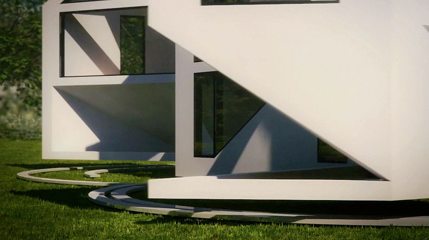
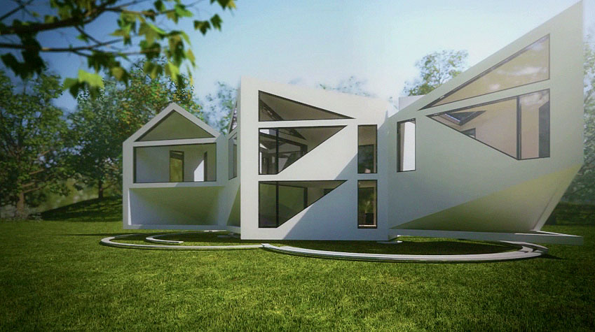
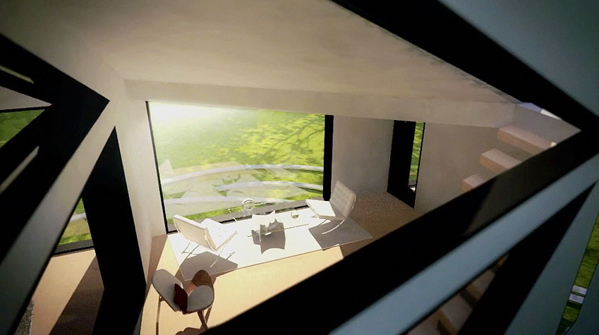
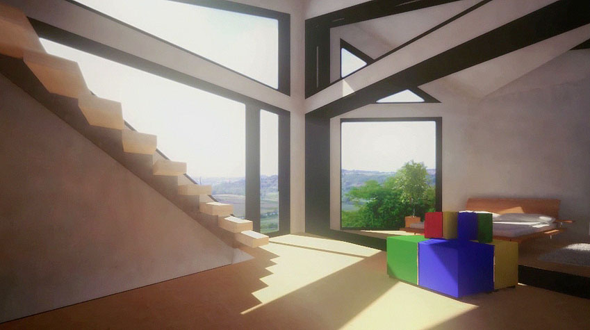

It's been quite some time since I've posted some work here, a lot of work I've done over the past few months has been just on a professional level. It's been hard to find a balance with time for personal work but as the colder weather approaches I'm sure there'll be more time for it.

One thing I want to try and do is write up posts on projects I work on, just a little post-project blog post with info, what worked well and could have worked better.

Something I did work on was this animation for Dhaus, I was responsible for the first minute of footage which is all CG. The turnaround for this was particularly tight due to some unexpected time off which reduced a 4 week timeframe to little over 2!

A few bits of information about the project:
<ul>
	<li>Vray was used for the fully CG parts and because of the tight turnaround it worked out in our favour to render out half-res irradiance maps. This worked really well for the most part, there were some patchy renders but some post work in Fusion managed to clear a lot of it up.</li>
	<li>Getting the trees and grass to look right was particularly difficult, a 2D VrayDisplacementMod was used on the ground and this impacted the render times greatly. Turn it off for the animation pre-pass, the difference is *barely* visible and the time you save is huge.</li>
	<li>Because of time constraints, I ended up doing some of the animated house opening shots in layers with a single background frame and then rendering the house and shadows separately. I should have done this with all the shots that would have allowed it, the time saved was huge.</li>
	<li>Render time should *always* be over-estimated, especially with limited resources. With no dedicated renderfarm, I only had evenings to render it out with the start of the work day being cut off point. This was a serious limitation and hindrance to the animation.</li>
</ul>
I really wish I had more time to render out the shots as they could have really benefited from higher quality settings, especially with regards to the light cache which was lower than I would have liked it to be. You can see some patchiness in the stills which is a bit less evident in the video.

Here's a few stills from the video and you can watch the video here where it was featured on the magazine Frame's website.

