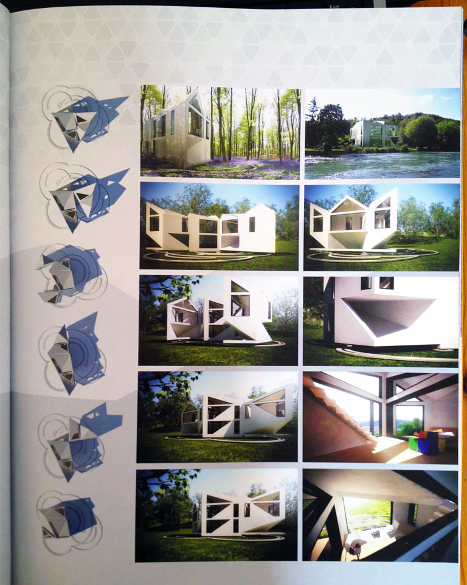

An animation which I worked on at AVR London has been getting lots of press over the past few months and I thought I'd post up a few places of where it's been featured. I put together a <a title="Autumn Update" href="http://www.carlocarfora.co.uk/blog/autumn-update" target="_blank">brief write up</a> at the end of last year about it.

The house and concept is by the brilliant guys at D*haus, and it's a very interesting idea with loads of creative applications and uses. You can find out more about it D*haus <a title="http://www.thedhaus.com" href="http://www.thedhaus.com" target="_blank">here</a> as well as see other places it's been published and shown.

