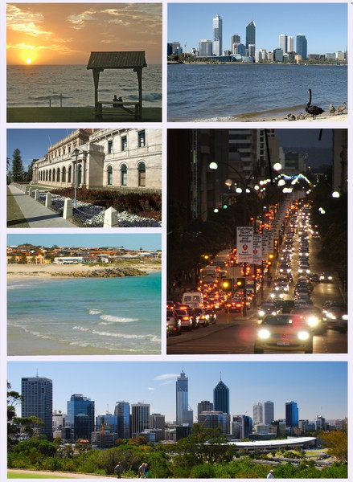

In October I'll be acting on the biggest decision of my life and living in Perth, Australia for the next year. It's a hugely exciting and in some ways daunting decision, but it feels like the right point in my life to do something drastic. The time for small incremental changes is over, if I'm going to change anything it's time for a "Hail Mary" move.

Here in the UK I have a job, a car, live with my family and am able to go out and do things I'd like to do. I also commute for an hour each way every day to and from work, and feel like there isn't enough time in a day for my interests outside of work . Add to that the feeling that there's more to life than working a standard 9-5 and commuting, and I've come to the decision that it's time to start a new adventure abroad!

The easiest way into Australia is with a Working Holiday Visa (WHV) which will let you stay for one year and let you work during your stay. It's got some restrictions, you can' t be at the same place of work for more than 6 months being one of them but it's a relatively minor
 hindrance in my opinion. To stay longer than a year as well you have to do seasonal work, which from what I hear can be tough.

Many people write blogs about moving to another country and starting something and I've enjoyed reading them, but now I'm excited to actually be in a position to write one about my personal experiences!
