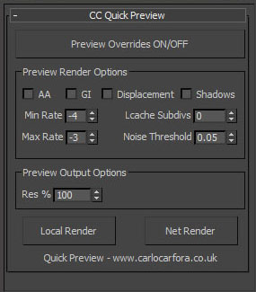

Here's a small script I wrote to give me an RPM-esque workflow when working on a simple one or two render job. I find RPM can be cumbersome when you're working with stills or just 1/2 cameras. If preview overrides is not on, local render simply uses your current render settings. If it's enabled, the following properties below will be active. The tick boxes disable scene properties, and res changes the resolution. When you need to render final, you can simply untick preview and then hit Net Render to send to backburner.

My workflow with this script is to define my final (or near final) render settings first, then use the script to test renders as the scene progresses before final renders. It's for Vray only I'm afraid! Download it [here](http://www.carlocarfora.co.uk/resources.html)

