When starting this project, I had a clear goal to experiment and try out things that I usually don’t have the time for at work. When working to deadlines, you usually have to work with what you know will give you a good outcome and the pressures of time never usually leave much for experimentation.

I decided an interior would be an ideal and tidy project, having been inspired by some of the more interesting interiors on various websites and forums recently. It’s also the sort of project you can really get stuck into, working up details and lighting as well as some post work!

Read on to find out more, and check out the full res images above or by clicking <a title="Interior Space" href="http://www.carlocarfora.co.uk/portfolio-item/interior-space" target="_blank">here</a>.

<!--more-->
<h3>Idea/Planning</h3>
The concept and idea of this interior was heavily influenced by this set of photographs depicting a lovely living space. I liked it so much I decided I would attempt to recreate in 3D, not perfectly though. I wanted to inject some of my own personality into it, and experiment a bit too. I’m not an interior designer or architect, so having a designed base from me to work from made it much easier. It’s sometimes more time consuming trying to design something from thin air than  to modify an existing design.

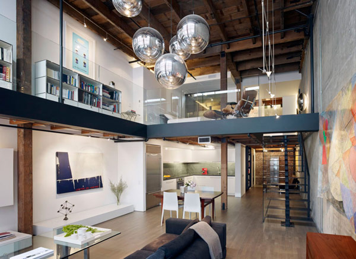

I wanted to work in quite defined stages; planning, modelling, cameras, lighting/render settings, texturing, wrangling, post. I tried to make sure that I would be happy with each part before I moved on to avoid going around in circles.

You can see my reference images put into a moodboard below; I always try to collect as much reference before a project. You can never have enough!

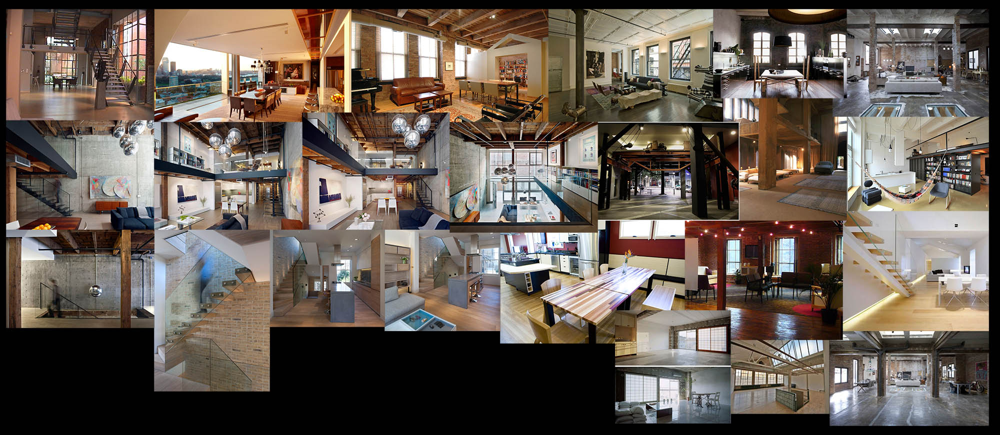

<h3>Goals</h3>
What am I hoping to achieve from the project? Is it a personal portfolio piece, a test bed for new techniques or am I refining and pushing my existing skillset?

Being able to answer these questions when I start a personal piece of work helps me to know exactly what I’m trying to achieve from it. In this case, I had some clear goals and not so clear goals in my head. I wanted to do as much in the render as possible, avoid Photoshop completely and use Nuke as I was working (sort of) linear. I wanted to try and achieve photo-realism, potentially hyper-realism if I could, and I wanted to try some new techniques for lighting and rendering. With this all in mind, I could get started on the project!
<h3>Project /Scene Setup</h3>
I feel quite comfortable with 3D modelling, and I knew didn’t want to spend all my time modelling assets so I began searching the internet as well as my own personal model library for usable assets. If I was practising my modelling I would have made an effort to model everything in the scene but as it was more about the lighting/materials/rendering I wanted to get to that stage as quickly as possible.

I like to collect a palette of objects before I start modelling anything, it helps me to organise what I will need to create myself and what I can detail up/ modify from existing models.

When I have all of the objects I can find or think of I’ll start with a new scene and set my gamma/units to the correct settings. I always work in Meters and with a linear-ish workflow. My settings are the same as those I see often but here they are below:

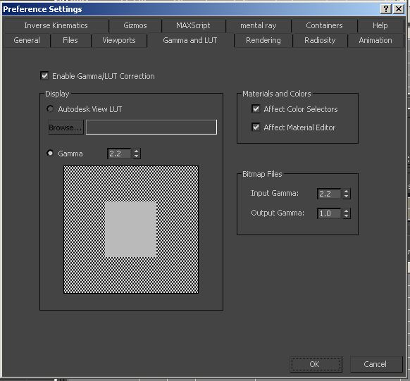

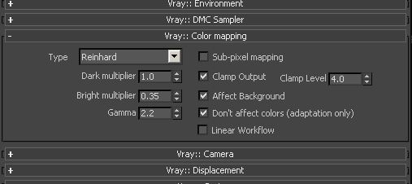

What I did differently here is use Reinhard as opposed to Linear Multiply. The reason for this was that I knew I wasn't going to be compositing these back together, I was going to be taking the raw beauty render and just tweaking things like colours or adding DOF. I really enjoyed working like this, there’s something satisfying about getting it almost all correct in the render! I clamped at 4 to avoid getting those super bright jagged lines from any hotspots but it still gives me plenty of range. Looking back and writing this, I should really have rendered these out with a value of 1.0 in the gamma and corrected the curve in Nuke so that is a lesson learnt for next time! Burning the gamma in is nice when you are working in Photoshop, and we do this at work as standard practice. Something I’ll remember to do next time!

If you’re wondering what that is in my screenshot, its RPM (Render Pass Manager). I’ll take a second to talk about it now so it isn’t confusing later on down the line in other screenshots.

<a title="RPM" href="http://rpmanager.com/about.htm" target="_blank">RPM</a> is a 3DS Max plugin that lets you easily manage and organise your scene using cameras and passes. You can have separate settings for each camera, and it takes the confusion out of using different cameras with different resolutions. It’s not free, but there is a free personal 2 pass license and I find it to be exactly what I need at home. You could always save out separate max files for more than 2 cameras but that would be negating how useful it is! For this making of, I’ll have RPM in my screenshots because it’s now such a part of my process. Hopefully if you haven’t used it you will give it a go on your next project!
<h3>Room Modelling</h3>
I’ve already mentioned that modelling wasn’t something I wanted to put time into on this project so I tried to keep my scenes clean and minimal; something that seems to be a trend in modern interior design at the moment luckily!

I built the room, walls and mezzanine using common techniques such as spline and box modelling. Working from a top view, spline out the walls then extrude up. From there I can begin to add floor plates etc. I used the awesome Floor Generator script to create the floor, and a MaterialByElement modifier to create different material ID’s for the floor.

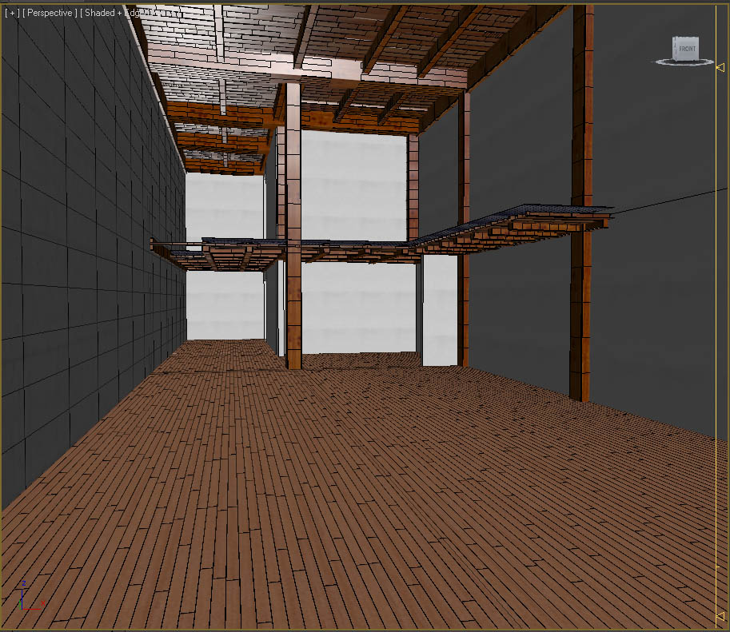

For the ceiling and wooden beams, I used boxes and a subtle noise to get the irregularity. I didn’t need too many subdivisions because I knew the texture would mask this. Box modelling was used throughout the scene for objects and splines were used when I needed a surface or to have something follow a path.

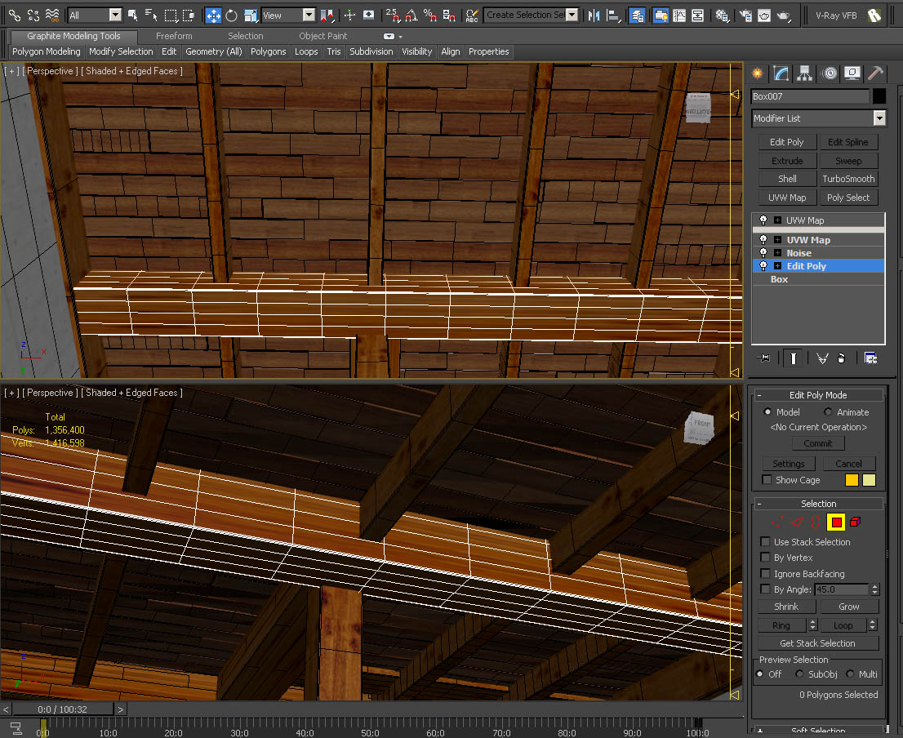

There wasn’t anything too tricky to model in this scene, keeping my models as light as possible is always important to keep the scene responsive. I’m doing everything on an i5 PC with only 8GB of RAM so it was extra important to keep the scene tidy.
<h3>Scene populating/Assets</h3>
From the models I’d found during the planning stage I was able to populate the interior using my reference as a guide. I also took some artistic liberties and added some personal touches to the interior. I wasn’t thinking about textures/materials at this point, just what I'd like to have in the scene.

I wanted to try out VrayFur, I’d never used it before so thought it would be ideal for a rug. It was much less complicated than I thought, I simply checked the Vray Help files for information on what each parameter did; here are the settings I used for the rug:

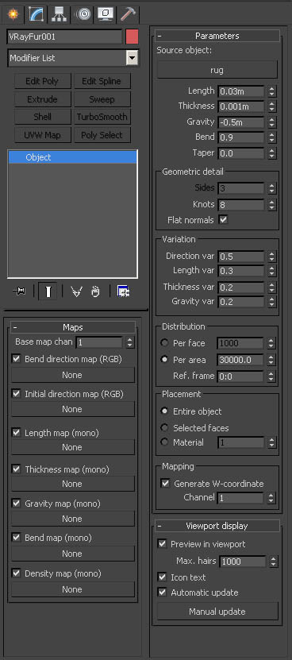

As I still didn’t have any cameras locked down, I just tried to make it feel like somewhere that would be habitable. Using the reference I’d collected was so helpful at this stage, it’s so important to get as much as you can. If you even see one small thing you like in an image, save it to the reference folder!

Here’s where the scene was now at:

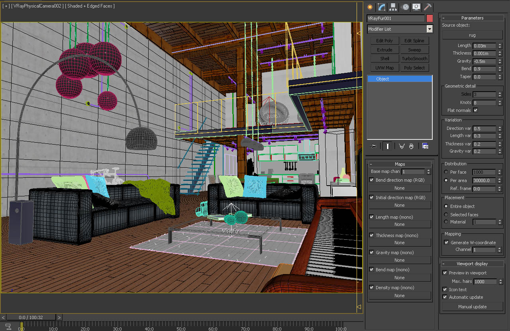

I also took the time to organise my scene using the layers dialog, I have my own conventions for naming layers and organising a scene and everyone probably has their own way of doing things. It’s a good idea to do this periodically so your scene isn’t unmanageable by the end. Doing this lets me hide and freeze heavier geometry layers and keep viewport performance/responsiveness at a decent level.

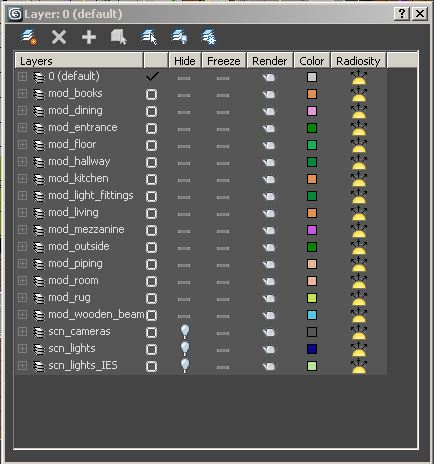

<h3>Lighting</h3>
I knew before starting this project I wanted to try lighting this scene with a HDRI as it’s something I’ve never really explored. Using the excellent tips from people such as <a title="http://www.peterguthrie.net/" href="http://www.peterguthrie.net/" target="_blank">Peter Guthrie </a>there was plenty of information on various workflows. I ended up using a single HDRI with these settings:

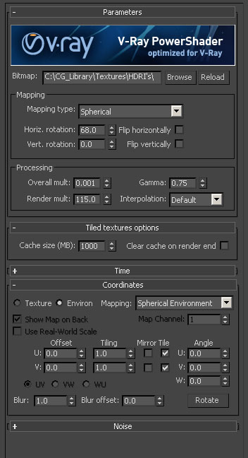

Here’s my VrayLight settings:

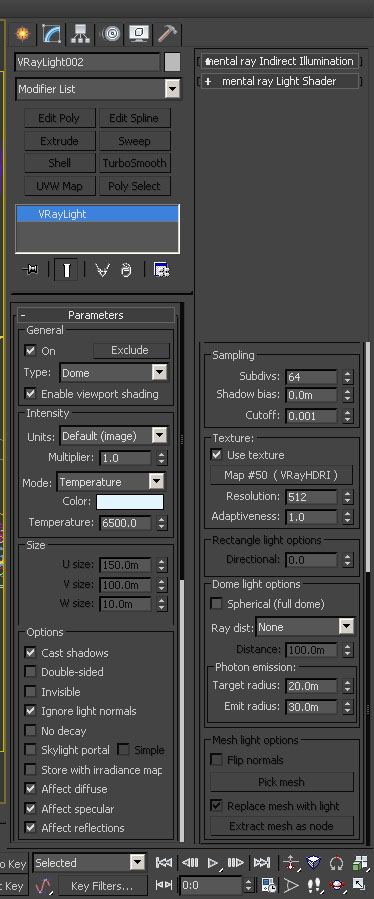

I also had Vray IES lights with a nice IES downlight profile for my lights. I increased the power of them to make them readable. While not strictly accurate I like the contrast in lighting it gives.

I used a Vray Override material excluding only things which are glass (so that my windows let in the light!) and tested my lighting settings like this to speed up render tests and so that I knew the lighting was working by itself and textures weren’t hiding anything.I used a selection set to organise the objects which would be overridden, to make it manageable.

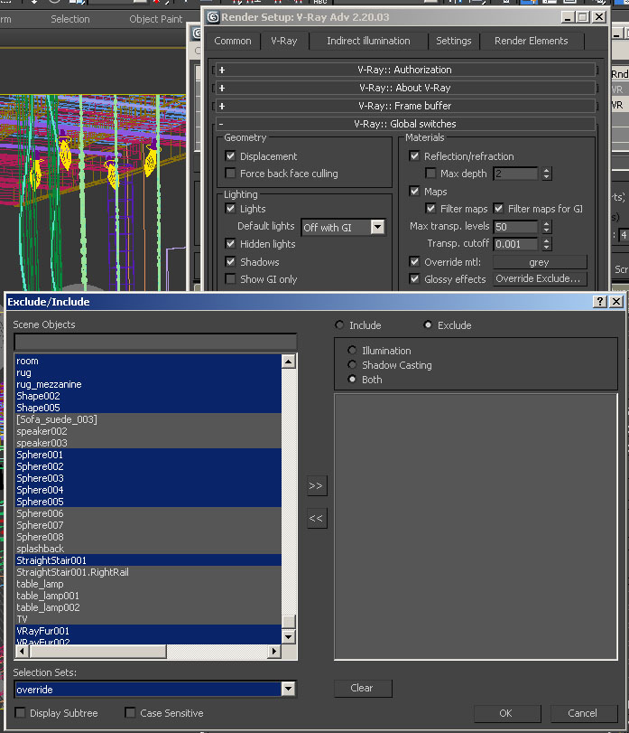

<h3> Cameras</h3>
My cameras all started with default settings, I like to test render with these settings to see how the exposure is working. I use the exposure controls in the VFB to see how much I need to adjust it and then change the f-stop number accordingly. If you increase the exposure by 1 in the colour controls for example you know that you need to change your camera exposure by 1 stop. Here’s where a bit of photography knowledge is useful; one stop could either be changing the f-stop number down, it could be decreasing the ISO, or even the shutter speed. For the sake of keeping things simple, I use the f-stop (although I also adjusted the shutter speed for this particular camera!).

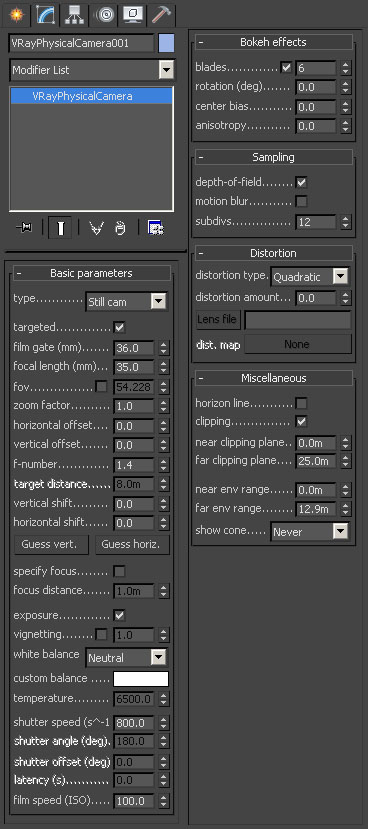

I then made made a render pass in RPM, using the camera I'd' just created and within RPM I would adjust the settings; this would let me use the preview tab and set up my elements.

<h3>Render Settings</h3>
To be able to test my cameras and lighting I would have to get my render settings locked in and for this project I wanted to test both my usual Irradiance Map/Light Cache combination as well as Brute Force/Light Cache.

I’ve been using the method outlined by <a title="http://www.jamesshaw.co.nz/blog/?p=542" href="http://www.jamesshaw.co.nz/blog/?p=542" target="_blank">James Shaw</a> for a while now when using IM/LC as it’s a repeatable process that always seems to get me consistent results. It’s such a detailed write up I won’t bother trying to summarise it and if your using IM/LC it’s a must read. Here are the settings I ended up using:

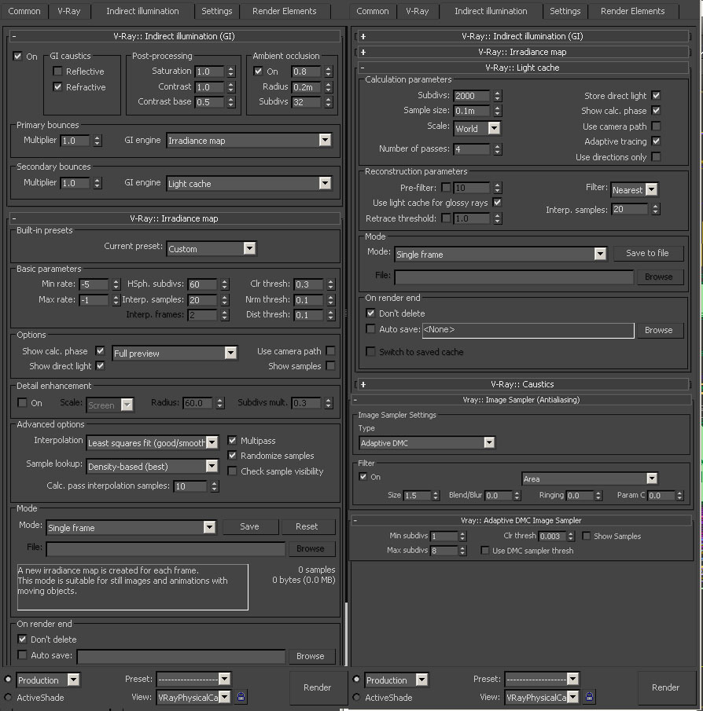

Once I had my settings locked in, I used the preview tab in RPM to change the resolution, IM and LC settings to something that would render much faster. I also disabled AA to speed things up. Knowing I have my production settings ready, it's a very fast process from here on testing and tweaking. I can simply ramp up and down the quality using the preview tab when I'm creating materials to check everything is working properly.

Here's what my preview tab looks like:

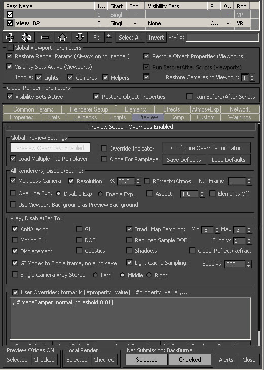

<h3>Brute Force</h3>
I wanted to test out a couple of shots using a Brute Force/Light Cache set up as it's something I've never tried out. I set these shots to render out at 2k because of my under-powered machine. I didn't want it to be on for too long and 2k was enough for this particular project.

Here are my Brute Force settings, thanks to <a title="http://www.ronenbekerman.com/photographic-approach-in-architectural-visualisation/" href="http://www.ronenbekerman.com/photographic-approach-in-architectural-visualisation/" target="_blank">this article</a> and <a title="http://www.interstation3d.com/tutorials/vray_dmc_sampler/demistyfing_dmc.html" href="http://www.interstation3d.com/tutorials/vray_dmc_sampler/demistyfing_dmc.html" target="_blank">this article</a> for clearing up so much. While I still don't FULLY understand Adaptive DMC inside out to the level of this article, I think I understand enough to have an idea of how the values are connected to each other and what they influence:

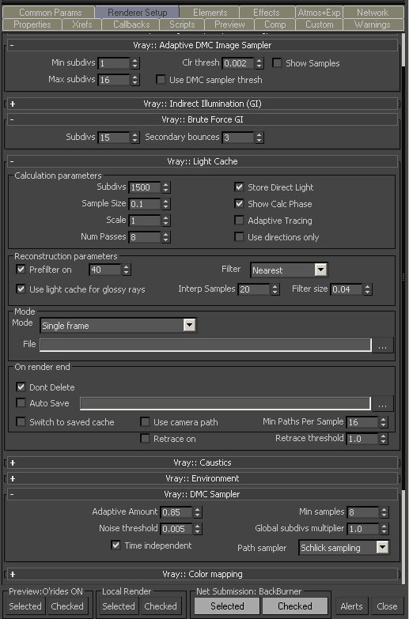

<h3>Materials</h3>
Now i had my render settings locked in, along with some camera settings I could work on materials. I used a different way of usually working than I usually would; I worked on each material individually adding it to the override selection set. This meant I could test what each material looked like without having to render materials on everything else. This was mainly to speed up renders because of my PC speed but it was a nice regimented way of working and I think I'll be doing it this way in future projects.

I kept my materials simple, using bitmaps only where needed. Most materials used diffuse, glossiness, bump, falloffs, etc. Everything has a fresnel reflection apart from mirror surfaces and I have a slight glossy grime map for things that might not have a specific gloss map. This was to simulate the fact that everything is a little dirty from being handled etc. Here's what some of my material settings are like:

<strong>Wood:</strong>

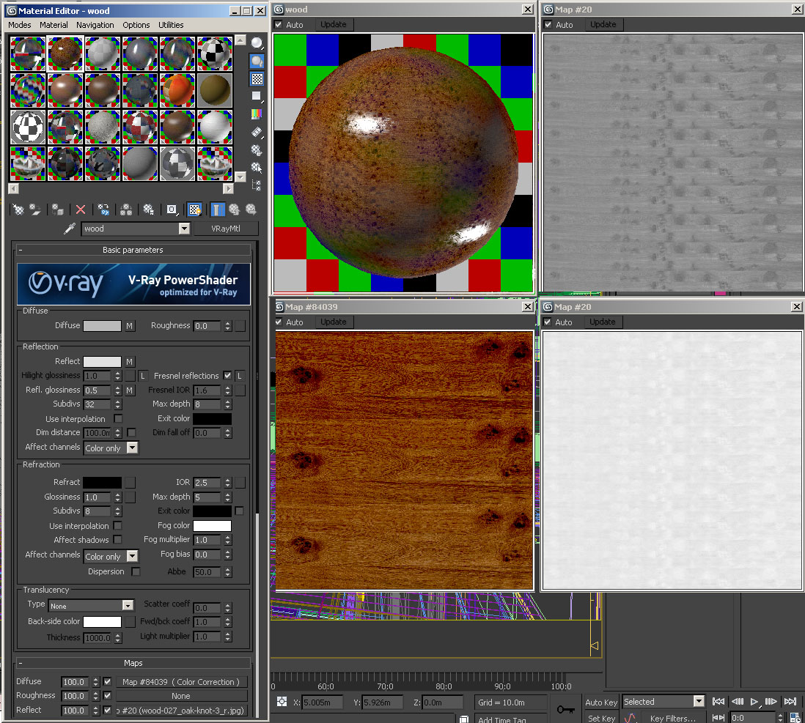

<strong>Glossy-ish Painted Metal:</strong>

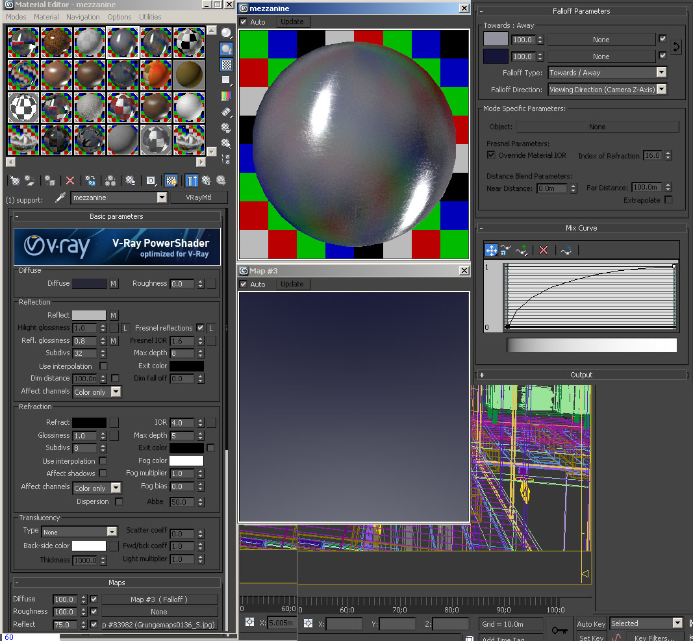

<strong>Shiny Metal:</strong>

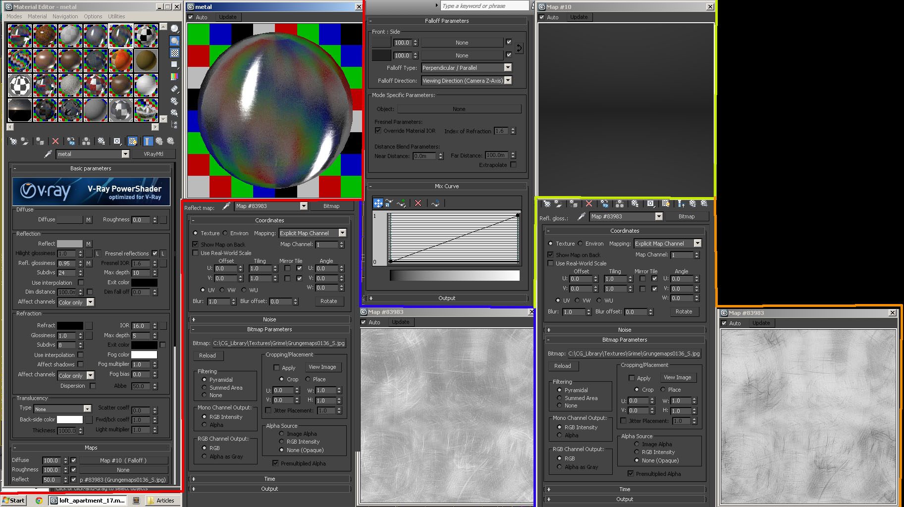

Once everything in my scene had a material I did a full test render then tweaked accordingly. I tend to use lots of render regions at this point from my cameras working on getting things just the way I want. It can be a tedious process, but it really pays off in the end.

<h3>Render Setup</h3>
As I mentioned before I had my render settings locked in so all I had to do was set up my passes and hit render. For this I opted to just have the beauty pass, Zdepth and wire color. I used render to Vray frame buffer and saved my image as an EXR file.

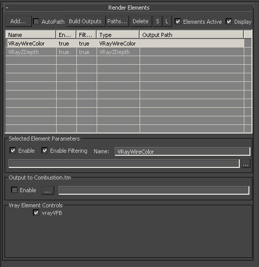

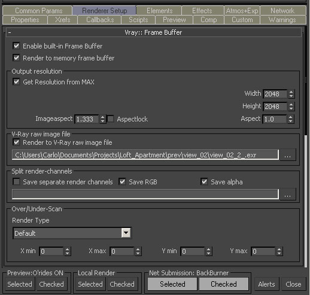

<h3>Post-Processing</h3>
Because I was hoping to do everything in the render I decided to not use Photoshop for this project and Nuke instead. It loves 32-bit EXR's, and even on my under-powered machine working at 4k it was slow but usable. Impressive!

I tried not to go overboard, just colour grading to suit my taste and adding some DOF. I saved out the 4k images at 2k and left the 2k as is. As you can see there wasn't much to it, I was really happy with how much the raw renders had. I'm usually one to fix a lot in post as it's quicker but without deadlines I could tweak to my hearts content!

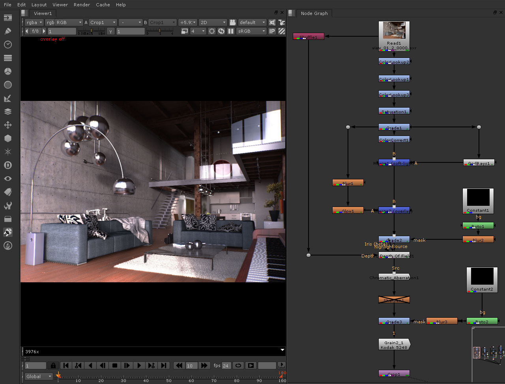

The Brute Force renders didn't even need a Zdepth, I'd rendered my DOF using Vray so the comp was even easier. This was the first time I'd used Vray DOF and while slow it looked better than I hoped.

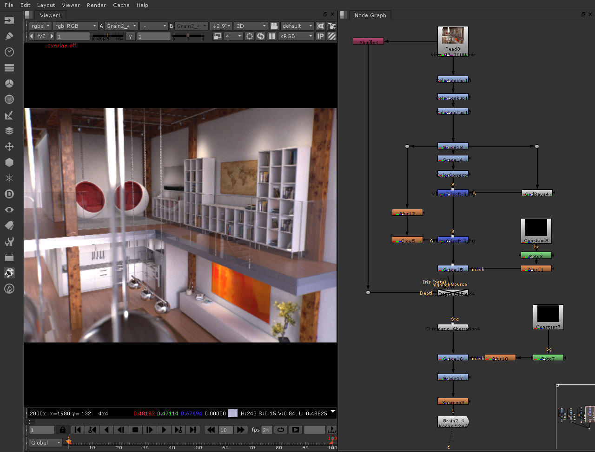

<h3>Final Thoughts</h3>
Hopefully something I've written here has been useful to somebody, I tried not to make it too much of a step by step but rather give an overview of each of my processes.

A lot of the things I did were fairly simple and are probably done by many of you every day but what I enjoyed most about working on this was the experimentation of trying new approaches to things I usually do in my own particular way. I will now be using HDRI's to light many more of my scenes, using material override exclude much more and now I have a better much understanding of Adaptive DMC and Brute Force. It's given me a good idea of when it might be applicable to use these techniques in a professional environment.

I would have liked to have displacement on the concrete wall but it was simply taking my computer too long to pre-compute displacement and so I decided to leave it out in the end. I would have also liked to create an environment outside but opted for a photo instead. It just left with me no flexibility for an exterior shot looking in. Maybe this will be my next project!

Thanks for your time and I hope you enjoyed reading this article, it was a lot to fun to break down my work and it's helped me personally see lots of things I can improve on in my next project!
