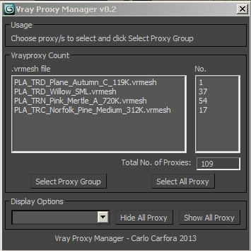

Here's another small script, this one is to manage Vray Proxies in scenes. It's a simple window that lets you:

* See a count of total proxies and ones that share the same .vrmesh
* Select all proxies sharing .vrmesh
* Hide/Show all Vray proxies
* Change display mode for allVray proxies at once

Pretty much all there is to it, find it in the [resources](http://www.carlocarfora.co.uk/resources.html) section!
