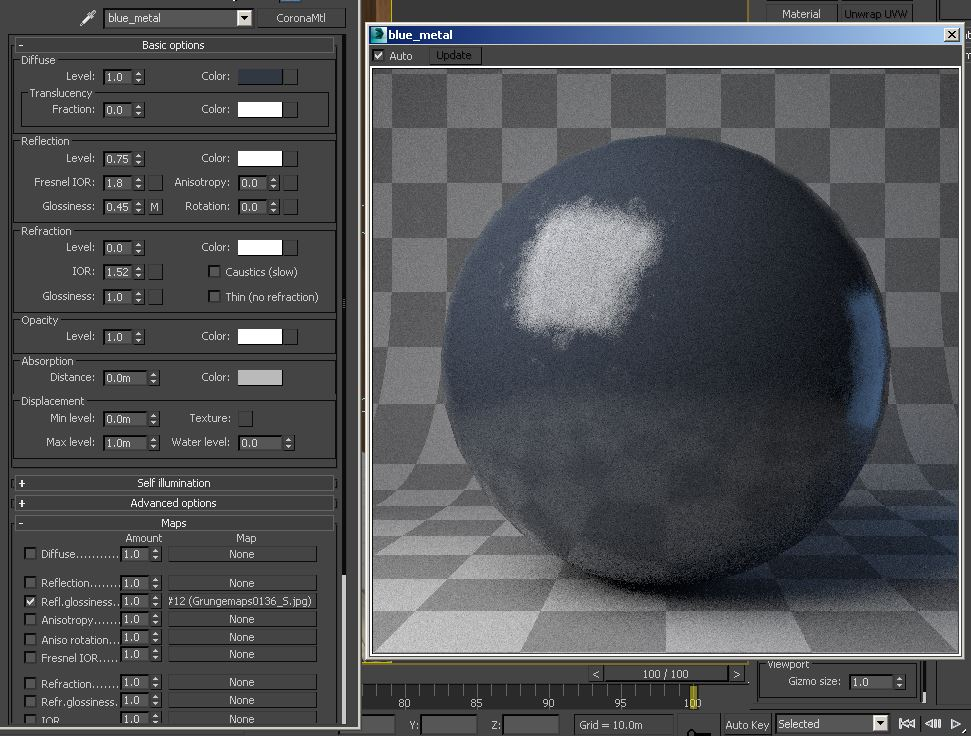

I have been working exclusively in Vray for the better part of 2 years now, before that it was mostly Mental Ray. When I switched over to Vray there was quite the learning curve and I have to say it's only in the past year that I have really got to know Vray in depth and understand its strengths/weaknesses. It's so dependable, and we've pushed it to some real extremes with the large scale projects we deal with at work.

It was with some reserved expectations I tried out Corona, some of the stuff on the forums looked amazing but every renderer has some pretty images! I have to say I was extremely taken back by how quick it was to pick up the Corona workflow, and how easily the Vray knowledge could be crossed over.

I put this interior together as a test, I had a lot of fun making this and it was awesome to get iterative feedback on how the scene is shaping up really quickly and easily. I've put a write up together as a mini guide below; hopefully it's of some use to anyone thinking of giving Corona a go or starting to use it!

###Scene Setup

Getting the basics right to make sure we'll have no problems later on down the line. Now there's various ways to control gamma/linear workflow in Vray, but Corona keeps it simple. Just set max gamma on and material/bitmaps ticked if you want it to be controlled too (I have both ticked).

Working in real world scale will keep the renderer predictable and ensure there are no surprises when rendering.

###Modelling

Nothing too crazy here, I used a combination of reference materials, library models and some from the usual places on the net to put together the interior.

I try to reference real photographs as inspiration/guides so that the scene feels a bit more grounded in reality so in this case I found a photo which I really liked and used that as a basis.

###Lighting

Here's where I feel like Corona really starts to shine, my Vray workflow transferred straight over and it felt easier to balance the light in the scene.

I started with a HDRI in the environment slot, using the VrayHDRI material for familiar control. I also gave everything a grey material override apart from the windows and other glass objects. 

Once I was happy with the light coming through the windows I put lights throughout the scene where they existed. I tried to keep them the same size as the fittings. Then it's just a matter of balancing the light to a point that you are happy with.

What I found great here was that I could predict the light much easier than Vray. I would have put lots of large plane lights to illuminate different sections in Vray but I found Corona didn't need all the extra lights.

###Materials

Making materials in Corona is no different than making materials in other render packages, I didn't detract too much from the way I would have approached making materials in Vray.

I used the thin glass setting with environment portals ticked for the glass leading outside as I found this sped up my renders without looking different.

I didn't have to raise my bump values very high for Corona to pick up the surface detail, so at first my renders looked extremely noisy but this was due to the bump being much too high on most of my materials. Something to watch out for!

Oh, and another thing that caught me out was using the standard Blend material. This really slowed my scene down a lot and I didn't even notice until I rebuilt the material using a composite later on down the line. Don't use the standard Blend Material unless you HAVE to!

Here are some material setups:

###Rendering

Rendering in Corona feels almost too easy, the amount of settings to tweak are so minimal that it almost feels like there's a step missing! That said, I did tweak a couple of parameters to bring more direct light samples in and stop the image from getting too blown out. 

I used standard cameras with the CoronaCamModifier and for a couple of the shots used in camera DOF - something I wouldn't dream of doing with Vray.

Keeping the exposure settings dialled in via the render settings tab meant that adjusting the f-stop on the camera had no effect with the images exposure. It's explained in the tooltips that pop up when you hover your mouse over the settings, and it was a great way to dial in the DOF once the exposure was locked.

I didn't push the image too much with the colour mapping settings when I saved them because I like to do more of that in post, but it was nice to be dial in some initial looks straight in the VFB. Having a fairly even/flat image from the renderer though means I can push and pull it more in post.

I saved out the files as 16bit .exr's, and used all the CESSENTIAL elements as well as the ZDepth element.

###Post

Here I did quite a minimal amount of work. It was mainly just dialling in the look that I wanted using curves, levels and exposure. There is also some hue/sat and colour balance for tweaking the colours. 

I don't rebuild the image in Photoshop from the layers but use them to enhance the image in certain ways, I almost always give the image more reflection for example and I may mask areas where it looks like there is too much/little etc.

This is always the area where my images come to life, and having a great image to start with from the renderer makes it so much easier to achieve a pleasing result.

###Final Impressions

Finishing up this first project in Corona, I have to say that the learning curve from Vray was next to none. I did miss some of the more advanced Vray materials, especially VrayBlend. 

It was really awesome though to have near instant feedback while testing and refining lighting and materials by just dropping the res and the precalc multiplier, after the first 2 or 3 passes you can tell straight away if something’s working for you or not.

I don't see where I work switching to Corona any time soon simply because the Vray pipeline is pretty well cemented, but I can see lots of smaller 1-4 man shops switching over if progress continues the way it does. [Version 1](https://corona-renderer.com/blog/) of Corona looks like it's going to be great and the flexible licensing looks very affordable.

I'll certainly be using it at home in the future, it has a certain quality to it I find hard to replicate in Vray and I'm really happy with the final images.
