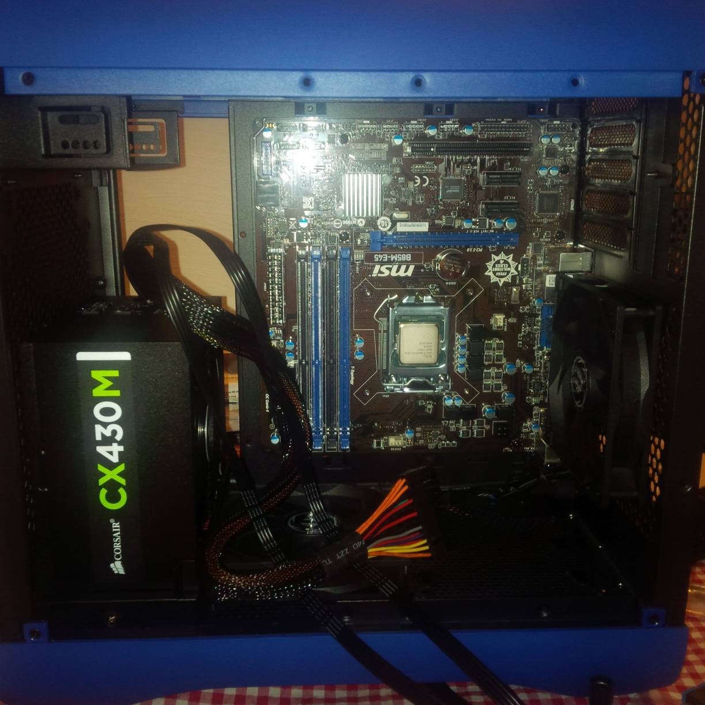

It's been a long time coming for me, a new PC build! I've spent the last 3 years (almost!) using a desktop I picked up for $100 off Gumtree and upgraded with some hand-me-downs from work. While it was perfectly ok for doing Arch Vis it really struggled with any sort of simulation projects.

After much debate, I bit the bullet and ordered a new PC; here's a write up of the build and some thoughts on spec and budget!

#####Specs

This was to be primarily a home workstation, so with that in mind I was less focused on gaming rigs and more on what would help when doing 3D work. I also had set a budget of $1000 (£500), not much to work with really!

After some research this is what I came up with for a part list:

* Corsair CX-430 Modular 80+ Bronze Power Supply $85.00
* Corsair Hydro Series H55 CPU Cooler $82.00
* Samsung 850 EVO Series 120GB 2.5in SSD $115.00
* Galax GeForce GTX 750 Ti Black OC Sniper Edition 2GB $179.00
* Intel Xeon E3 1231 V3 $369.00
* MSI B85M-E45 Motherboard $89.00
* BitFenix Prodigy M Case Blue with Window $129.00
* Corsair 16GB Kit (2x8GB) DDR3 Vengeance C9 1600MHz $127.00 

**Total cost: $1175**

A little over but this was the best trade off I was happy with in terms of speed vs budget.

**Corsair CX-430 Modular 80+ Bronze Power Supply** - Cheap and semi-modular power supply. You do pay for what you get though, my first unit was DOA and had to be sent back for a warranty replacement! Seems to be running fine now though.

**Intel Xeon E3 1231 V3** - This is pretty much equivalent to an i7 4970, without the integrated GPU. Really good value for money, check out the comparison [here](http://cpuboss.com/cpus/Intel-Xeon-E3-1231-v3-vs-Intel-Core-i7-4790).

**Corsair Hydro Series H55 CPU Cooler** - My first water cooler unit, was simple to install and seems to be keeping the CPU cooled well. I got this mainly because I was worried about clearance issues with the case. A similarly priced air cooler would have been just fine (the E3 1231 v3 actually comes with a stock one) but the H55 is pretty silent too which is a nice bonus.

**Samsung 850 EVO Series 120GB** - My OS drive, for my needs I didn't need a large drive just a fast one and this struck a good balance between performance and price. Also the newer series that replaces the 840 line.

**Galax GeForce GTX 750 Ti Black OC Sniper Edition** - As the 3D I do is almost all offline, there was no need to get anything with great performance. I could have got an R9 for the same price which is better performance in gaming but Nvidia cards play nicer with the software I use so that was the reasoning for this choice.

**MSI B85M-E45 Motherboard** - The Xeon line are locked, which means no overclocking. This meant I just needed a motherboard that worked, and was reliable since the PC would be on under full load for extended periods of time when rendering. I chose this for it's price and Intel chipset.

**BitFenix Prodigy M Case Blue with Window** - I had chosen the case before any other part! Went for MATX over Micro ATX because of the 16GB limit with Micro ATX boards. I have to say the case was difficult at times to manoeuvre around inside but it's well constructed and looks great. As you'll see from the pictures it was a challenge to get the cables tidy but it was possible in the end.

**Corsair 16GB Kit (2x8GB) DDR3 Vengeance C9** - Got these on a special, for a workstation that's going to be doing lots of rendering and simulations it's more about how much RAM that's in the box rather than speed. I'll most likely upgrade to 32GB with the same set in the very near future.

Also dropped in a 1TB HDD I have from my old PC as well as a few fans from the old case.

#####Build

Here's the build in pictures :)

 All the parts in their boxes

 The case on it's own

 Inside the case

 Starting to assemble, I'm not the neatest!

 Putting in the motherboard

 PSU went in and came out at the end when it sparked and died 

 Drive plate which blocks the window so never used

 SSD's go here, very awkward with SATA and power cables

 Cooler is in!

 PC so far

 Skip forward to booting for first time

 Sourced additional fans so had to power them, decided on a fan controller and chose the Bitfenix Recon

 Cable management hell!

 Back at the desktop, got conky working too!

 Shot of the fan controller glowing

 Replacement PSU fitted, cable management was due! 

 A final shot with the window on

I will say that building the PC in this small factor case was a real challenge at times; not because everything won't fit (there's ample room it's quite surprising actually!) but because it can be awkward to move around inside it! If you have larger hands you could get really frustrated building a PC with this case.

It was my first MATX build and I'm really happy with the final footprint, it's awesome to have the tower off the floor and it just looks good on the desk. It looks a bit more flash than I originally wanted but in the end it toes the line between ridiculous and cool quite well I think.

#####Performance

I haven't done any official benchmarks but I can tell you it boots up in under 10 seconds, and shuts down in about 2 seconds.

It's done some heavy lifting already, including a 15 hour 300 frame render and some heavy fluid simulations that took upwards of 8 hours for the same amount of frames. I was a little worried I may have put the cooler on incorrectly and it would cook but that wasn't the case!

I haven't played any games on it either, don't think I will be any time soon as it was built primarily as a workstation.

#####OS 

I'm running [Linux Mint 17.2](http://linuxmint.com/) and using the Xfce desktop, mainly just for the extra squeeze in performance when using Houdini.

##### Final Thoughts

Very happy! It's amazing the hardware available out there now for people building a PC on a budget, you can get a lot of performance for not a lot of cash if you know what to look for. 

I think the steal of the build was definitely the processor, amazing performance for a really good price. 

I would have loved to get a better graphics card and knowing that I could have got a better card for the same price can be annoying. In the end though, compatibility reigns supreme so it's a trade off I'm happy to accept. If I played games on the PC I might have been a little less enthused. 

If I was really strict with the budget, I could have even shaved some more off by choosing a cheaper case, PSU, motherboard and even GFX card. I tried not to go for the cheapest option for anything in this build though because I felt like I had the budget for it.

Well that's it, I hope this has been of use/interest to someone out there who may be building a similar PC in the near future. Thanks for reading!
